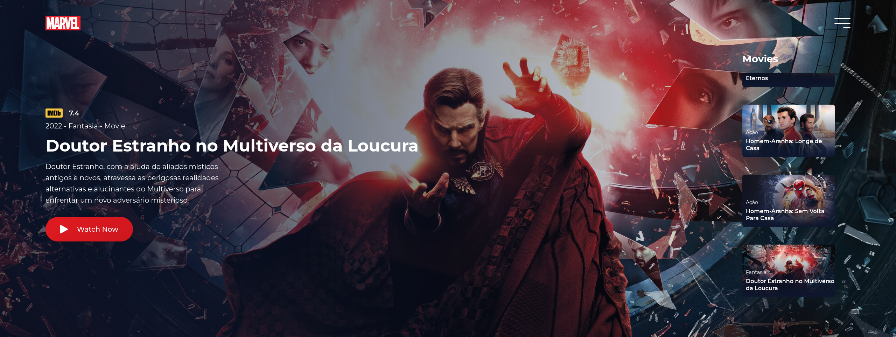

<h1 align="center">
  Marvel Films
</h1>

  

## 💻 Projeto

Esse projeto foi desenvolvido com base no projeto do Disney Films [Disney Films](https://github.com/lucianovictor/disney-films)

## 🚀 Tecnologias

- HTML
- CSS
- JavaScript
- [API TMDB](https://www.themoviedb.org/documentation/api)

## 📝 Conhecimentos abordados

- [x] Uso semântico do HTML
- [x] Integração com a API do TMDB ao usar o `fetch`
- [x] Criação de elementos dinamicos com o uso do `createElement`
- [x] Estrutura de variavei globais
- [x] Uso de variáveis globais no `:root`

## 🏁 Start Dev Environment for VSCode

1. Open project folder in `VSCode`
2. Install `Live Server` and `Live Sass Compiler` extension
3. Right click `index.html` > `Open with Live Server`
4. Access the **generated address** in your browser 🚀
